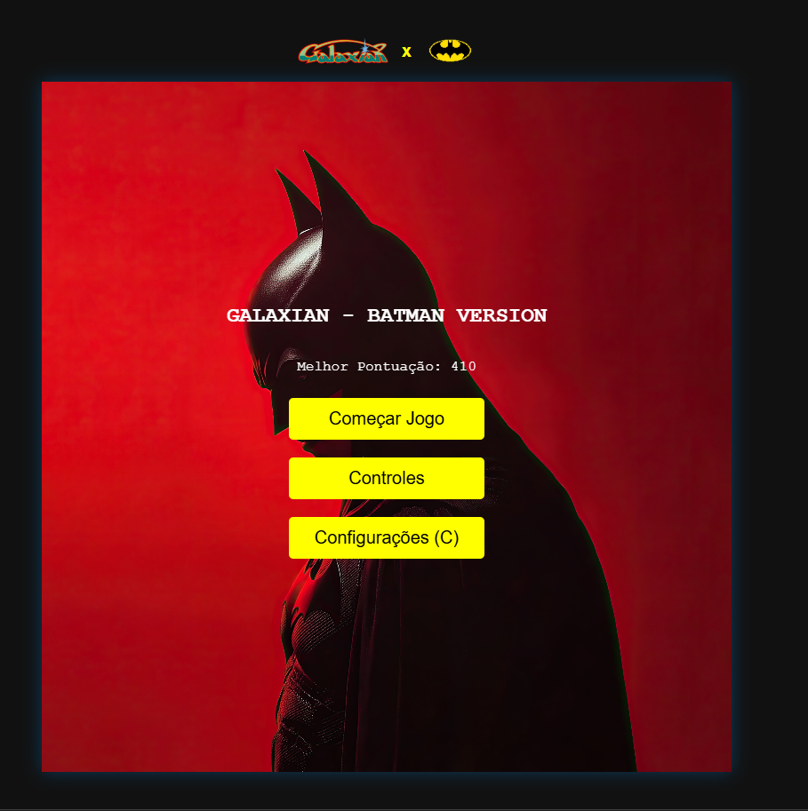
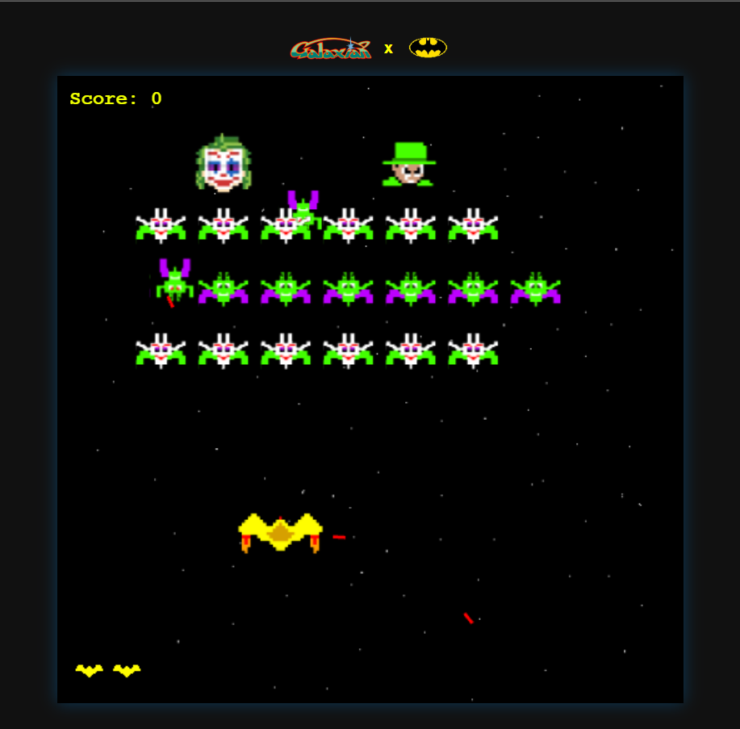
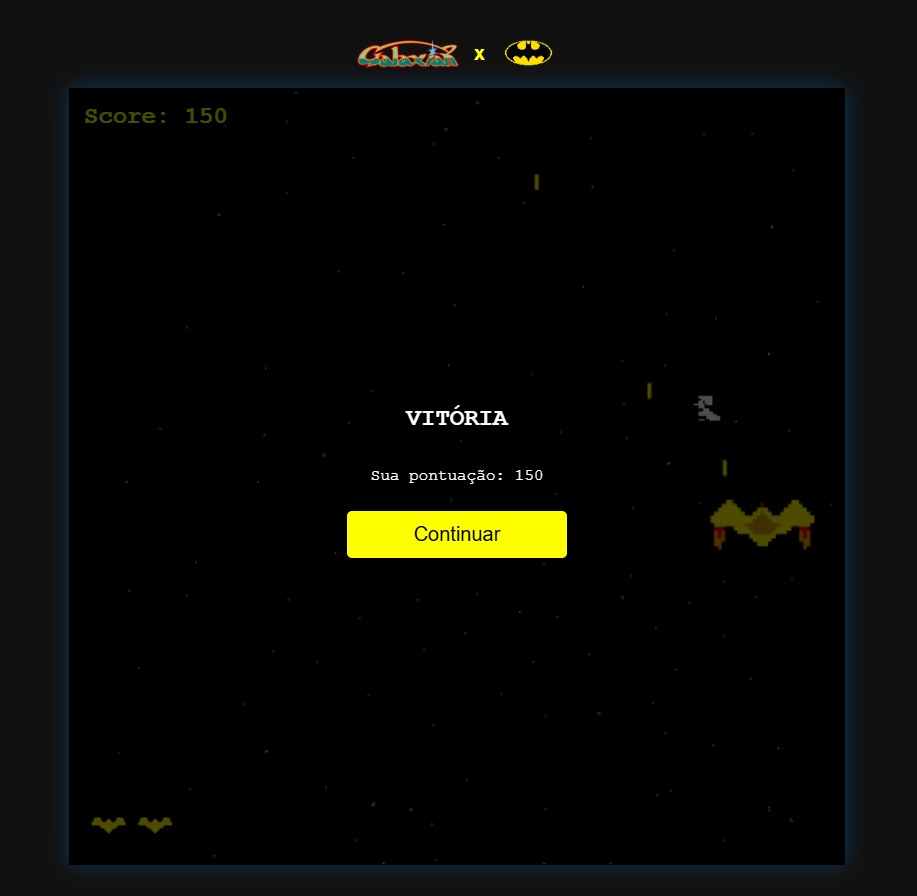

# TP1 - Galaxian em WebGL

Jogo estilo Galaxian desenvolvido para a disciplina de Computação Gráfica, usando WebGL2 e JavaScript puro, com lógica orientada a eventos.

## Descrição breve

O jogador controla uma nave na parte inferior da tela e deve derrotar todos os inimigos para vencer a rodada. Os inimigos se movimentam em bloco, atiram contra o jogador e podem realizar ataque rasante em curva. Se a vida do jogador chegar a zero ou os inimigos avançarem demais, ocorre game over.

## Autores

- Nome : Gustavo Alcântara do Nascimento

## Link do jogo publicado

- GitHub Pages: https://gustavoalcantaran.github.io/TP1/

## Vídeo da entrega

- YouTube: https://www.youtube.com/watch?v=AhcMNCFSmRQ

## Controles

- Seta esquerda / A: move para a esquerda
- Seta direita / D: move para a direita
- Seta cima / W: move para cima
- Seta baixo / S: move para baixo
- Espaço: dispara tiro
- Esc: pausa/continua
- R: solicita reinício (com confirmação in-game)
- C: abre/fecha menu de configurações

## Regras principais implementadas

- Movimentação dos inimigos em bloco
- Descida da esquadra ao tocar bordas laterais
- Tiros do jogador
- Tiros dos inimigos
- Colisão entre tiro do jogador e inimigos
- Colisão entre tiros inimigos e nave
- Condição de vitória (eliminar todos os inimigos)
- Condição de derrota (vida zerada)
- Pausar/continuar com Esc
- Reiniciar com confirmação in-game
- Uso obrigatório de texturas (nave, inimigos, fundo, efeitos e HUD)

## Funcionalidades adicionais implementadas

- Texturas animadas
	- Nave com mudança de frame por direção
	- Inimigos com animação de spritesheet
	- Explosão animada por spritesheet
- Fundo com movimento vertical (scroll)
- Rasante de inimigos com curva de Bézier
- Tipos diferentes de inimigos (incluindo variantes maiores)
- Fases progressivas (rodadas com aumento de dificuldade)
- Itens/perks
	- Aumento de cadência de tiro
	- Aumento de velocidade da nave
	- Lentidão temporária dos inimigos
- Sistema de pontuação em HUD
- Melhor pontuação salva em localStorage
- Sistema de vidas com HUD visual
- Telas completas de jogo
	- Menu inicial
	- Pausa
	- Configurações
	- Controles
	- Game over
	- Vitória
- Efeitos sonoros e trilha de fundo
- Tela cheia

## Estrutura do repositório

- index.html: Estrutura da página e shaders
- estilos.css: Interface e Menus
- main.js: Lógica do jogo, renderização e eventos
- gl-utils.js: Utilitários WebGL
- assets/: Texturas e imagens do jogo
- Soundtrack.mp3 e Gameover.mp3: Áudio do jogo
- Screenshots : Capturas de tela para o README

## Recursos de terceiros

- Imagens:
	- Imagem de Fundo do Menu Inicial : https://4kwallpapers.com/movies/batman-red-19038.html
    - Spritesheet Explosão : https://br.freepik.com/vetores-gratis/folha-de-sprite-de-animacao-da-sequencia-de-explosao-de-bomba_29084609.htm

- Áudios:
	- Áudio da Gameover : https://downloads.khinsider.com/game-soundtracks/album/batman-nes
    - Áudio de Fundo :  https://downloads.khinsider.com/game-soundtracks/album/batman-nes

## Screenshots da entrega

- Screenshot 1: 
- Screenshot 2: 
- Screenshot 3: 

## Como executar localmente

1. Clone este repositório.
2. Abra a pasta no VS Code.
3. Execute com um servidor local (por exemplo, Live Server).
4. Abra o jogo no navegador.